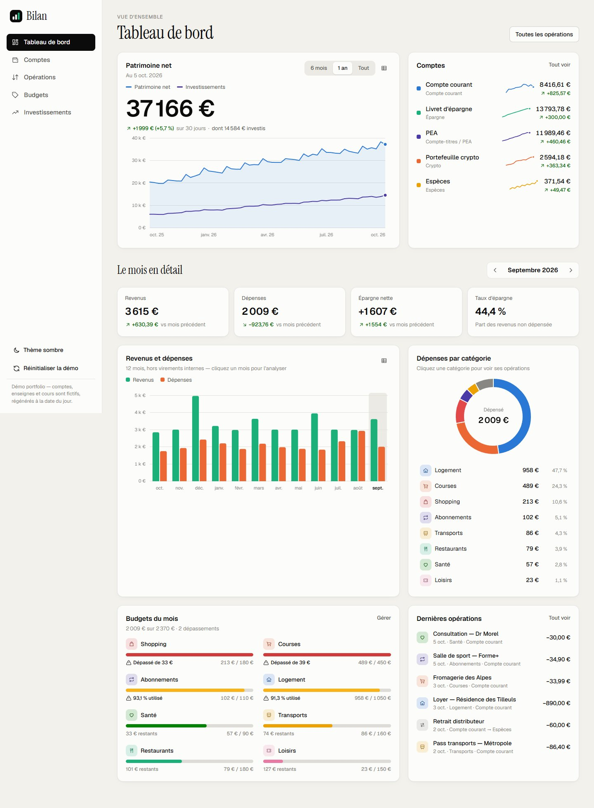
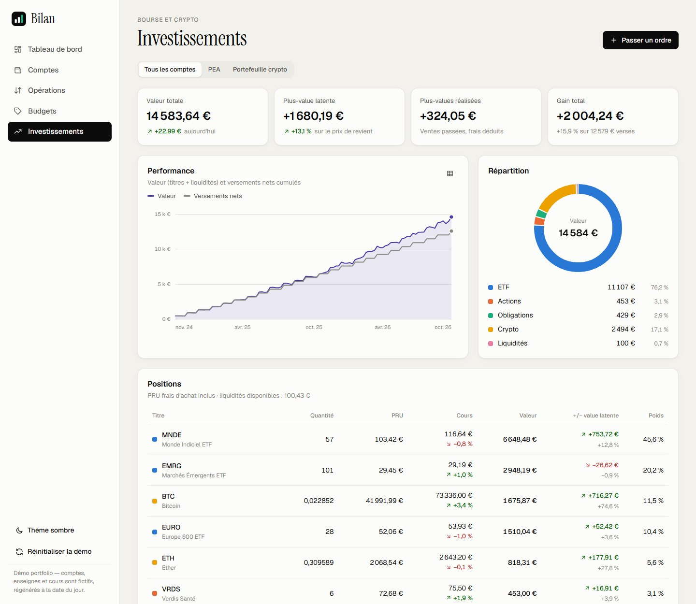
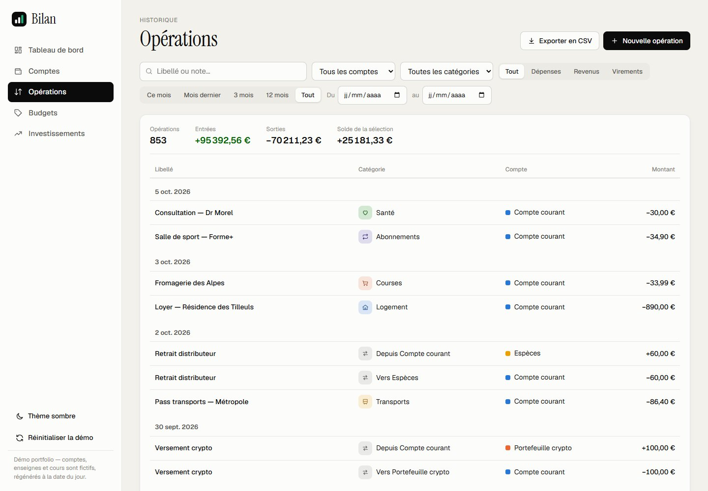
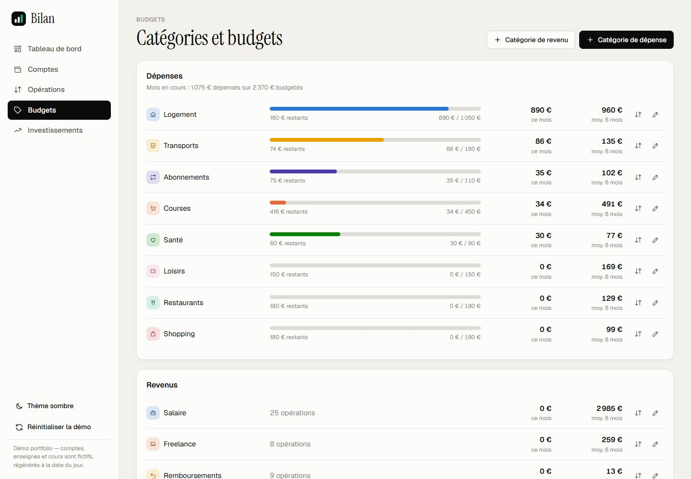
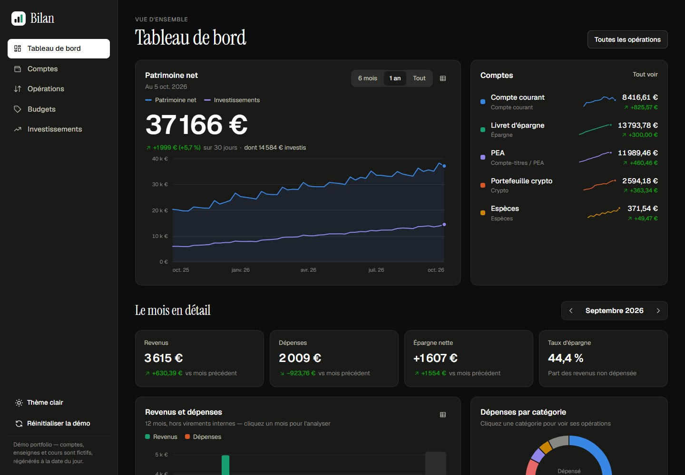
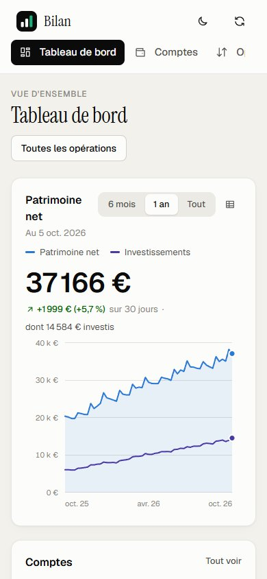

# Bilan — gestion de portefeuille

Application de suivi de portefeuille et de finances personnelles : comptes, opérations, catégories et budgets,
investissements (actions, ETF, obligations, crypto), tableaux de bord et graphiques.
Front **Angular 22**, back **Java 21 / Spring Boot 4**, base **PostgreSQL**. Tout se lance avec une commande Docker.

> Projet de démonstration pour mon portfolio : comptes, enseignes, titres et cours sont **fictifs**. Deux ans
> d'historique sont générés à partir de la date du jour, de façon déterministe, puis régénérés automatiquement quand
> ils vieillissent : la démo est toujours à jour.



## Essayer en 30 secondes

```bash
docker compose up --build
```

Puis ouvrir **http://localhost:8089**. Arrêt : `Ctrl+C`, puis `docker compose down` (ajouter `-v` pour repartir d'une
base vide). Le bouton « Réinitialiser la démo » de la barre latérale régénère toutes les données.

| Service    | Image                              | Rôle                                                  |
| ---------- | ---------------------------------- | ----------------------------------------------------- |
| `frontend` | nginx (build Angular multi-étapes) | Sert le SPA sur `:8089` et relaie `/api` vers Spring  |
| `backend`  | JRE 21 (build Maven multi-étapes)  | API REST, valorisation, données de démo               |
| `db`       | postgres:17-alpine                 | Comptes, opérations, ordres et cours                  |

## Fonctionnalités

- **Tableau de bord** : patrimoine net (chiffre vedette, évolution hebdomadaire sur 6 mois / 1 an / tout), revenus,
  dépenses, épargne nette et taux d'épargne du mois, flux sur 12 mois (un clic sur un mois l'analyse), dépenses par
  catégorie, suivi des budgets, dernières opérations.
- **Comptes** : courant, épargne, compte-titres / PEA, crypto, espèces. Solde valorisé, variation sur 30 jours,
  tendance sur 12 mois, répartition du patrimoine, fiche détaillée avec historique du solde.
- **Opérations** : recherche (libellé, note), filtres par compte, catégorie, type et période — **dans l'URL**,
  partageables —, totaux de la sélection, pagination serveur, **export CSV** (format Excel français). Saisie de
  dépenses, revenus et **virements internes** (deux écritures liées, éditées comme un tout).
- **Catégories et budgets** : couleur et icône au choix, budget mensuel avec jauge (alerte à 85 %, dépassement), montant
  du mois et moyenne sur 6 mois.
- **Investissements** : positions avec **PRU** (coût moyen pondéré, frais inclus), plus-values latentes et réalisées,
  variation du jour, répartition par classe d'actifs, performance (valeur face aux versements nets), historique des
  ordres. Fiche par titre avec graphique des cours.
- **Règles métier côté serveur** : pas de vente à découvert (rejouée à chaque date), pas d'achat sans liquidités, pas
  d'opération avant l'ouverture du compte, catégorie cohérente avec le signe du montant. Erreurs au format
  ProblemDetail, affichées sous le bon champ.
- **Thème clair / sombre**, responsive jusqu'à 390 px, navigation clavier dans les graphiques, vue tableau de chaque
  graphique.

| Investissements                                    | Opérations                                   |
| -------------------------------------------------- | -------------------------------------------- |
|  |  |

| Budgets                               | Thème sombre                                          | Mobile                              |
| ------------------------------------- | ----------------------------------------------------- | ----------------------------------- |
|  |  |  |

## Parti pris graphique

- **Graphiques SVG écrits à la main** (courbes, colonnes groupées, anneau, sparklines), sans bibliothèque : échelles
  « rondes » (1-2-5), réticule qui s'aimante à la date la plus proche, infobulle listant toutes les séries,
  navigation aux flèches, et une **vue tableau** pour chaque graphique.
- **Palette catégorielle validée** pour le daltonisme, avec des teintes distinctes en sombre (pas une simple
  inversion). La couleur suit l'entité (un compte, une catégorie, une classe d'actifs), jamais son rang. Les états
  (budget dépassé…) sont toujours doublés d'une icône et d'un libellé.
- *Instrument Serif* pour les titres, *Geist* pour tout le reste, chiffres tabulaires dans les colonnes.

## Architecture

```
bilan/
├── backend/                 Spring Boot 4 (Java 21)
│   └── src/main/java/dev/forthtilliath/bilan/
│       ├── account/         Comptes : CRUD, valorisation, historique du solde
│       ├── category/        Catégories, budgets, cumuls mensuels
│       ├── transaction/     Opérations et virements : recherche (Specification), totaux, export
│       ├── investment/      Titres, cours (PriceBook), ordres, positions (PRU), portefeuille
│       ├── wealth/          WealthTimeline : valorisation de chaque compte à n'importe quelle date
│       ├── dashboard/       Agrégats du tableau de bord (Cashflow)
│       ├── demo/            Générateur déterministe : cours simulés, vie courante, plan d'investissement
│       └── common/          ProblemDetail (RFC 9457), arrondis monétaires, horloge injectée
├── frontend/                Angular 22 (standalone, signals, zoneless)
│   └── src/app/
│       ├── core/            Modèles, API, formats français, thème, palette
│       ├── shared/          Graphiques SVG, icônes, tiroir, jauges, tuiles…
│       └── features/        dashboard, accounts, transactions, categories, portfolio
└── docker-compose.yml       db + backend + frontend
```

Quelques choix :

- **Une chronologie unique** (`WealthTimeline`) rejoue les mouvements de liquidités et de titres pour valoriser chaque
  compte à n'importe quelle date ; tableau de bord, comptes et performance s'en servent. Les volumes d'un particulier
  tiennent en mémoire : 5 requêtes chargent tout.
- **Positions par coût moyen pondéré** (`Position`, immuable) : une vente sort du prix de revient au prorata, la
  différence avec le produit net est la plus-value réalisée.
- **Données de démo pures et déterministes** : un pont brownien « épingle » chaque cours sur sa performance cible (le
  hasard dessine le chemin, pas l'arrivée) ; les tests vérifient qu'aucun compte ne passe sous zéro et qu'aucune
  position n'est survendue.
- **Front en signals** : `httpResource` pour les lectures, `linkedSignal` pour garder l'affichage pendant un
  rechargement (pas de flash), formulaires réactifs typés dans un tiroir `<dialog>` natif.

### API

| Méthode               | Route                                  | Description                                     |
| --------------------- | -------------------------------------- | ----------------------------------------------- |
| GET                   | `/api/dashboard?month=AAAA-MM`         | Tableau de bord du mois                         |
| GET / POST            | `/api/accounts`                        | Comptes valorisés / création                    |
| GET / PUT / DELETE    | `/api/accounts/{id}`                   | Lire / modifier / supprimer                     |
| GET                   | `/api/accounts/{id}/history`           | Solde hebdomadaire                              |
| GET / POST            | `/api/categories`                      | Catégories avec cumuls / création               |
| PUT / DELETE          | `/api/categories/{id}`                 | Modifier / supprimer                            |
| GET                   | `/api/transactions?q=&accountId=&…`    | Recherche paginée + totaux                      |
| POST / PUT / DELETE   | `/api/transactions[/{id}]`             | Opération simple                                |
| POST / PUT            | `/api/transfers[/{transferId}]`        | Virement interne (deux écritures)               |
| GET                   | `/api/assets`, `/api/assets/{id}/prices` | Titres et cours                               |
| GET                   | `/api/portfolio?accountId=`            | Positions, répartition, performance             |
| GET / POST / DELETE   | `/api/trades[/{id}]`                   | Ordres (422 si survente ou liquidités insuffisantes) |
| POST                  | `/api/demo/reset`                      | Régénère les données de démonstration           |

## Qualité et sécurité

Une commande rejoue toute la CI en local (Docker requis), avec un récapitulatif final :

```bash
npm run verify         # tout : lint, types, tests, couverture, scans, pile Docker, E2E
npm run verify:quick   # sans Docker : lint, types, tests unitaires, build, audit npm
```

| Domaine | Outils | Seuil bloquant |
| --- | --- | --- |
| **Tests backend** | JUnit 5, AssertJ, **Testcontainers** (vrai PostgreSQL), ArchUnit | 55 tests ; couverture JaCoCo ≥ 95 % des lignes, ≥ 80 % des branches |
| **Tests frontend** | Vitest + TestBed (composants, formulaires, pages, `HttpTestingController`) | 59 tests ; couverture ≥ 85 % des lignes |
| **E2E** | Playwright contre la pile Docker (bureau + mobile) | 37 parcours, zéro erreur JS ou violation CSP |
| **Accessibilité** | axe-core sur les 5 pages, thèmes clair et sombre | zéro violation WCAG 2.1 AA sérieuse |
| **Lint** | `javac -Xlint -Werror`, PMD, ESLint (config partagée stricte), Stylelint, Prettier | zéro avertissement |
| **Types** | `strictTemplates` Angular, `tsc --noEmit` (app, tests unitaires, tests E2E) | zéro erreur |
| **Dépendances** | `npm audit` avec liste d'exceptions datée, Trivy (POM, `package-lock`), Dependabot | aucune vulnérabilité haute non justifiée |
| **Secrets** | Gitleaks sur tout l'historique, Trivy | aucun secret |
| **Conteneurs** | Trivy (images et Dockerfiles) ; JRE et nginx **non root** | aucune vulnérabilité haute corrigeable |
| **Code** | CodeQL (Java et TypeScript, requêtes `security-and-quality`) | analyse à chaque PR |

Mesures de sécurité de l'application :

- **En-têtes HTTP** (nginx) : CSP stricte (`script-src 'self'`, aucun script inline, `frame-ancestors 'none'`),
  `X-Content-Type-Options`, `Referrer-Policy`, `Permissions-Policy`, `Cross-Origin-Opener-Policy`, version du serveur
  masquée, corps de requête limité à 64 ko, sondes `/actuator` non exposées.
- **API** : validation de chaque entrée (Bean Validation + règles métier), montants normalisés au centime, recherche
  bornée, requêtes paramétrées (JPA Criteria), erreurs ProblemDetail sans trace technique, remise à zéro de la démo
  limitée (429 + `Retry-After`).
- **Front** : aucun `innerHTML`, texte saisi toujours échappé (testé en E2E avec une charge XSS).

## Développement local

Prérequis : Node.js 22+, Java 21+, Docker (pour PostgreSQL). Maven n'est pas requis (wrapper inclus).

```bash
npm install && npm --prefix frontend install
npm run dev        # PostgreSQL (docker, port 5436) + Spring Boot (:8082) + ng serve (:4200, proxy /api)
```

| Commande                                 | Effet                                                   |
| ---------------------------------------- | ------------------------------------------------------- |
| `cd backend && ./mvnw verify`            | Compilation stricte, PMD, tests (Testcontainers), JaCoCo |
| `npm --prefix frontend run test:coverage` | Tests Vitest avec seuils de couverture                  |
| `npm --prefix frontend run lint`         | ESLint (et `lint:css` pour Stylelint)                    |
| `npm run test:e2e`                       | Playwright contre la pile Docker (`npm run demo` avant)  |
| `npm run audit`                          | Audit npm avec la liste d'exceptions `security/`         |

## Code partagé

Le front s'appuie sur mes paquets [`@forthtilliath/*`](https://github.com/Forthtilliath/forthtilliath-packages) :
`ts-kit` (`debounce`, `toCsv`, `downloadCsv`, `formatCsvNumber`), `ts-types` (`Brand` pour les identifiants typés),
`eslint-config` et `typescript-config`.
